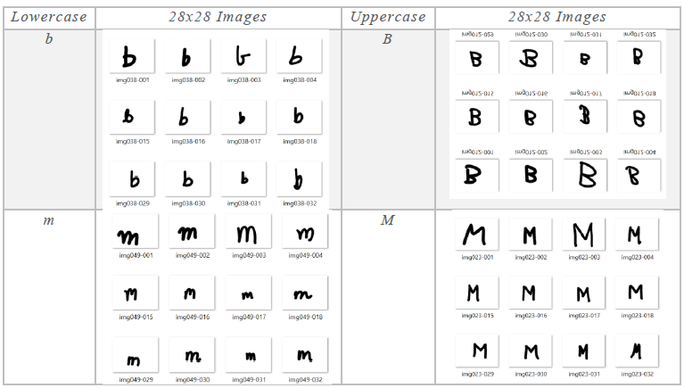
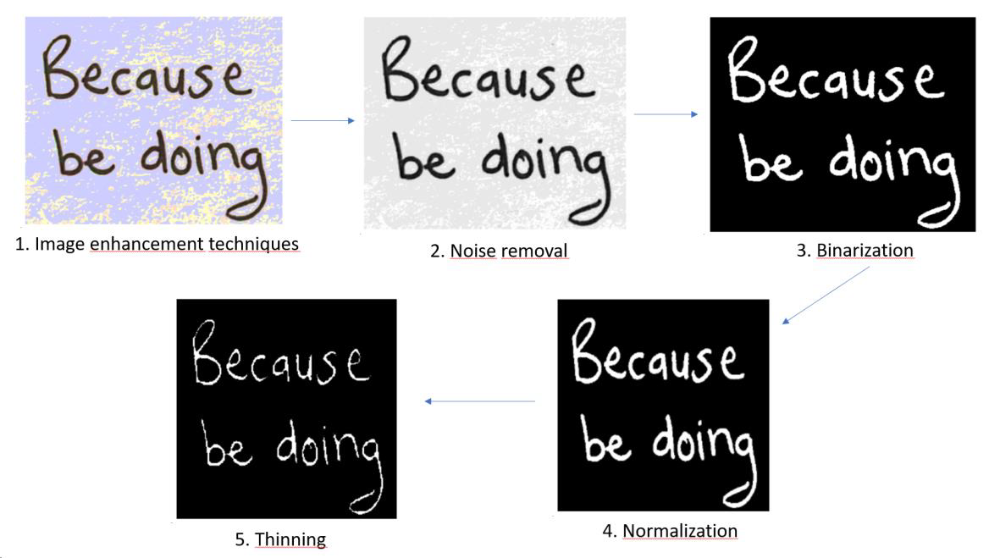
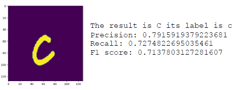

# OCR-handwriting-recognition

# ✍️ Handwriting Recognition with Deep Learning (EMNIST + CNN)

This repository contains a complete implementation of a **handwritten character recognition system** using **Convolutional Neural Networks (CNNs)**.  
The project was developed as part of the **CS512 – Computer Vision** course, and extends classical MNIST approaches by recognizing **47 alphanumeric classes** (letters + digits) from the **EMNIST Balanced** dataset.

📄 **PDF report included** — see `Handwriting recognition.pdf`.

---

## 🚀 Project Summary

Handwriting recognition is a challenging Computer Vision task due to variations in:
- style  
- slant  
- thickness  
- noise  
- writing speed  

In this project we:
- Preprocess and standardize handwritten images  
- Segment words → characters  
- Build multiple CNN architectures  
- Evaluate using accuracy, precision, recall, and F1 score  
- Compare results to the original research paper  
- Implement custom image-processing pipeline (thinning, denoising, binarization)  
- Recognize full sentences using character-by-character inference  

------

## 🧠 Methodology

### **1️⃣ Image Preprocessing**
We implemented a complete pipeline using OpenCV:
- Gaussian blur  
- Noise removal  
- Grayscale conversion  
- Adaptive thresholding & binarization  
- Normalization  
- Morphological thinning  

### **2️⃣ Segmentation**
Two custom segmentation methods:
- **Word segmentation**
- **Character segmentation** (for full-sentence OCR)

### **3️⃣ Model Architecture (CNN)**
The main model uses:
- 4 convolution layers  
- MaxPooling  
- Batch normalization  
- Dropout regularization  
- Dense classifier (47 classes)

### **4️⃣ Training & Tuning**
Hyperparameters tested:
- learning rate  
- batch size  
- epochs  
- activation functions  
- data augmentation  

### **5️⃣ Evaluation Metrics**
We compute:
- Accuracy  
- Precision  
- Recall  
- F1 score  

---
## 📊 Results

### **Validation accuracy: ~87%**  
### **Full-sentence OCR accuracy: 36%**  
(Difficult due to very similar letter shapes and segmentation complexity)

#### Description of the data

#### Image Preprocessing

#### Segmentation

#### Output Char

#### Model Performance

